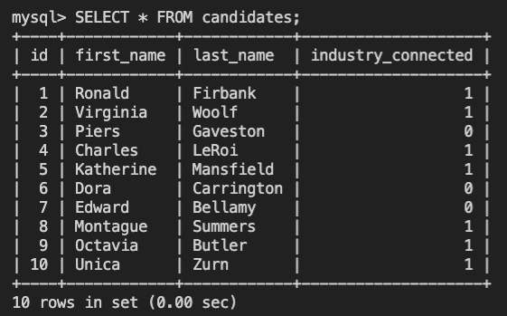

# SQL: U Vote It

- [Description](#description)
- [Technology](#Technology)
- [Installation](#installation)
- [Usage](#usage)
- [Test Instructions](#test-instructions)
- [Contribution](#contribution)

## Description:

A voting application for a local developer meetup group called U Develop It.

## Technology:

Project is created with:

- Javascript
- MySQL
- Node.js
- Inquirer.js
- Jest

## Installation

To run this project, install it locally using npm:

```
npm install
```

## Usage

After installing npm packages, the application will be invoked by using the following command:

```
npm start
```

#### Example Screenshot



## Test Instructions

To run tests for this application, you can run the following command:
`npm run test`

## Contribution

Made by Wenwen Tian
